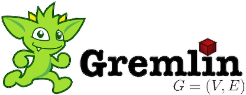

# JanusGraph (in Docker) - Lessons learned


Docker deployment of [JanusGraph](http://janusgraph.org/). To run,

```bash
docker-compose up --build
```

Note that a version of [Docker Compose](https://github.com/docker/compose) with support for version `3` schemas is required, e.g. `1.15.0` or newer.

Afterwards, you can connect to the local Gremlin shell using

```bash
docker-compose exec janus ./bin/gremlin.sh
```

The `python-test` subdirectories contains some simplistic Python scripts to test communication with JanusGraph.

Sources for the `Dockerfile` and their surroundings were basically taken straight from Titan setups:

* [efaurie/docker-titan-cassandra](https://github.com/efaurie/docker-titan-cassandra)
* [elubow/titan-gremlin](https://github.com/elubow/titan-gremlin)

For multiple graphs in Titan (and likely also JanusGraph), follow these links:

* [How many graphs can i create in one Titan DB?](https://stackoverflow.com/a/40545537/195651)
* [Serving multiple Titan graphs over Gremlin Server (TinkerPop 3)](https://medium.com/@jbmusso/serving-multiple-titan-graphs-over-gremlin-server-tinkerpop-3-d3c971d07964)
* [One graph in one Titan instance](https://jaceklaskowski.gitbooks.io/titan-scala/content/one_graph_in_one_titan_instance.html)

## Scylla/Cassandra and Elasticsearch

As per [compatibility matrix](https://docs.janusgraph.org/changelog/#version-compatibility-matrix), the supported Cassandra version is 3.11 and the supported Elasticsearch version is 6.6.
This repository uses [Scylla](http://www.scylladb.com/) instead of Cassandra, and according to the [Scylla Cassandra Compatibility](http://docs.scylladb.com/cassandra-compatibility/) matrix we find that Scylla 3.0 is a drop-in replacement for Cassandra 3.11.

The latest commit using Cassandra in this repo is 39c537de03a1bb7a65138b535df1ff003e8c4ec6, if you are interested in that.

## Gremlin Shell



This Docker example loads an [airline graph](janusgraph/data/air-routes-small.graphml) and
exposes it as graph `g` in `scripts/airlines-sample.groovy`.

After opening the Gremlin shell in Docker by running e.g.

```bash
docker-compose exec janus ./bin/gremlin.sh
```

You should be greeted by the Gremlin REPL shell:

```
         \,,,/
         (o o)
-----oOOo-(3)-oOOo-----
plugin activated: tinkerpop.server
plugin activated: tinkerpop.hadoop
plugin activated: tinkerpop.utilities
plugin activated: aurelius.titan
plugin activated: tinkerpop.tinkergraph
gremlin>
```

From here, connect to JanusGraph with a session, then forward all commands
to the remote server using `:remote console` (this allows skipping the `:>` syntax that's
required otherwise):

```
:remote connect tinkerpop.server conf/remote.yaml session
:remote console
```

You will find the airlines data exposed as graph `g`. We can inspect the vertex count by running e.g.

```
g.V().count()
```

This should return a value of `47`. Note that after restarting, the graph is imported again, resulting in
data duplication. To drop all vertices and edges - and then re-import from scratch - we can run

```
g.V().drop().iterate()
airlines.io(graphml()).readGraph('data/air-routes-small.graphml')
g.tx().commit()
```

To build an index over the `code` property, run

```
mgmt = airlines.openManagement()
code = mgmt.getPropertyKey('code')
mgmt.buildIndex('byCodeUnique', Vertex.class).addKey(code).unique().buildCompositeIndex()
mgmt.commit()
airlines.tx().commit()
```

We can then - for example - get all properties of the vertex with code `JFK`:

```
g.V().has('code', 'JFK').valueMap()
```

This should return:

```
==>{code=[JFK], type=[airport], desc=[New York John F. Kennedy International Airport], country=[US], longest=[14511], city=[New York], elev=[12], icao=[KJFK], lon=[-73.77890015], region=[US-NY], runways=[4], lat=[40.63980103]}
```

We could now run path queries, e.g. [find a path](http://tinkerpop.apache.org/docs/3.0.0-incubating/#simplepath-step)
between _Honolulu International_ and _Houston Hobby_ and return the airport codes and city names:

```
g.V().has('code', 'HNL').repeat(out().simplePath()).until(has('code', 'HOU')).path().by(valueMap('code', 'city')).limit(1)
```

This should return:

```
==>path[{code=[HNL], city=[Honolulu]}, {code=[DFW], city=[Dallas]}, {code=[HOU], city=[Houston]}]
```

To leave the shell, type `:quit`.

## Channelizers

You [have to choose the Channelizer](https://docs.janusgraph.org/basics/server/#janusgraph-server-as-both-a-websocket-and-http-endpoint) to work with, e.g. `HttpChannelizer`, `WebSocketChannelizer` or `WsAndHttpChannelizer`/`JanusGraphWsAndHttpChannelizer`.

Using the `JanusGraphWsAndHttpChannelizer`

```yaml
channelizer: org.janusgraph.channelizers.JanusGraphWsAndHttpChannelizer
```

allows for HTTP access to JanusGraph, allowing to e.g. determine `100 - 1` (hint: it's `99`)

```bash
curl "http://localhost:8182/?gremlin=100-1"
```

or running complete queries (URL encoded):

```bash
curl http://localhost:8182/?gremlin=g.V().has(%27code%27,%20%27JFK%27).valueMap()
```

... which is a bit clearer when using a JSON `POST`:

```bash
curl -X POST http://localhost:8182/ \
  -H 'Content-Length: 52' \
  -H 'Content-Type: application/json' \
  -H 'Host: localhost:8182' \
  -d '{ "gremlin": "g.V().has('\''code'\'', '\''JFK'\'').valueMap()" }'
```

## Python connectivity

To test connectivity with Python, try out the scripts in the [`python-test/`](python-test/) directory.
A conda environment is provided in [environment.yaml](python-test/environment.yaml):

```bash
conda env create -f environment.yaml
conda activate janusgraph
```

Try running the [gremlinpython](https://pypi.org/project/gremlinpython/) example:

```bash
python test_gremlin_python.py
```

This should output:

```
Hop 1: HNL - Honolulu
Hop 2: DFW - Dallas
Hop 3: HOU - Houston
```

Note that the [aiogremlin](https://aiogremlin.readthedocs.io/en/latest/) example is notoriously
broken; that's presumably because the package lags behind the TinkerPop version quite a bit.

## Cypher support

With [Cypher for Gremlin](https://github.com/opencypher/cypher-for-gremlin) (Opencypher), you can query Janusgraph using
the Cypher query language originating from Neo4j.
This repo provides a configuration that installs the required plugins.


Note that while the examples in this section work out of the box, some Java drivers will fail with
serialization issues such as `Encountered unregistered class ID: 65536` (e.g. in the Intellij [Graph Database support](https://plugins.jetbrains.com/plugin/8087-graph-database-support) plugin).
In order to have Cypher support working for those, you will need to "undo" Janusgraph specifics by doing the following changes.

In `gremlin-server.yaml`, replace

- `org.janusgraph.channelizers.JanusGraphWsAndHttpChannelizer` with `org.apache.tinkerpop.gremlin.server.channel.WsAndHttpChannelizer`, and
- `org.janusgraph.graphdb.tinkerpop.JanusGraphIoRegistry` with `org.apache.tinkerpop.gremlin.tinkergraph.structure.TinkerIoRegistryV3d0`.

Then, **use the GraphSON v3 serializer**, since both Gyro and GraphBinary will require
you to register the exact types. After this, you should be good to go.

### Using the Cypher Traversal Source

To use Cypher alongside with Gremlin, connect to the Gremlin console and run:

```
:plugin use opencypher.gremlin
g = EmptyGraph.instance().traversal(CypherTraversalSource.class).withRemote('conf/remote-airlines.properties')
```

Next, run your Cypher command using `g.cypher()`:

```
g.cypher('MATCH (p:airport) RETURN p.desc AS name')
```

You can also mix and match Cypher and Gremlin:

```
g.cypher('MATCH (p:airport) RETURN p').select('p').by(valueMap().select('desc').project('name')).dedup()
```

Or only use Gremlin:

```
g.V().hasLabel('airport').as('p').select('p').by(valueMap().select('desc').project('name')).dedup()
```

### Using Cypher directly (in the Gremlin Shell)

In the Gremlin shell, you can also run Cypher queries directly. To do so, run

```
:plugin use opencypher.gremlin
:remote connect opencypher.gremlin conf/remote-objects.yaml translate gremlin
```

Alternatively, server-side translations can be used (note the `:remote config alias g airlines` command!):

```
:plugin use opencypher.gremlin
:remote connect opencypher.gremlin conf/remote-objects.yaml
:remote config alias g airlines
```

You can then run Cypher commands directly on the remote source:

```
:> MATCH (p:airport) RETURN p.desc AS name
```

Note that `:remote console` does not work in this case.

The Cypher `EXPLAIN` command can be used to inspect the equivalent Gremlin query:

```
gremlin> :> EXPLAIN MATCH (p:airport) RETURN p.desc AS name
==>[translation:g.V().hasLabel('airport').project('name').by(__.choose(__.values('desc'), __.values('desc'), __.constant('  cypher.null'))),options:[EXPLAIN]]
```